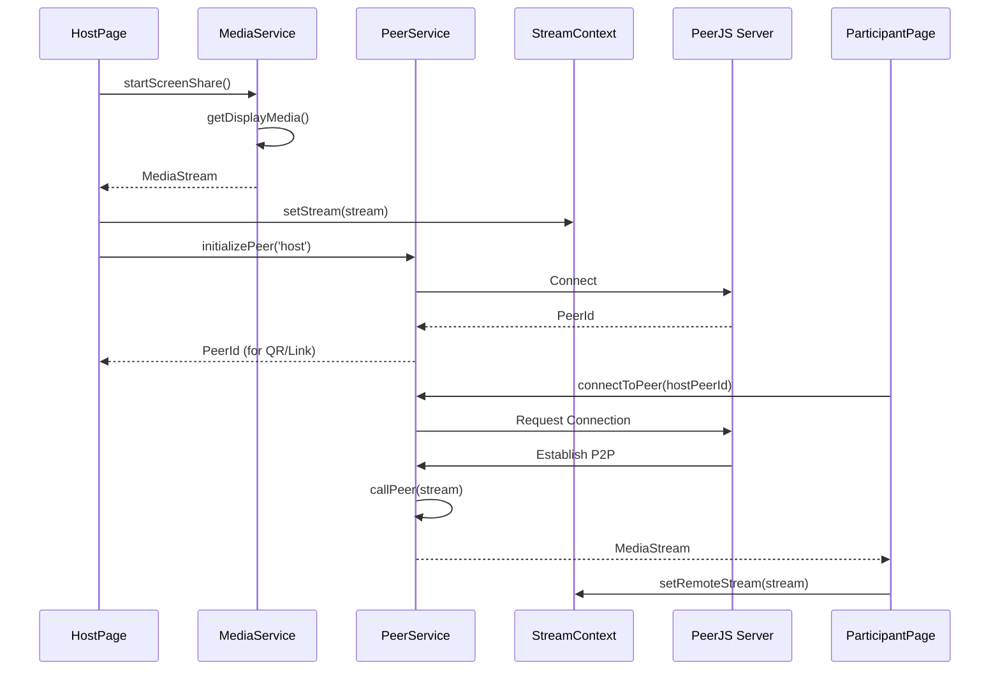
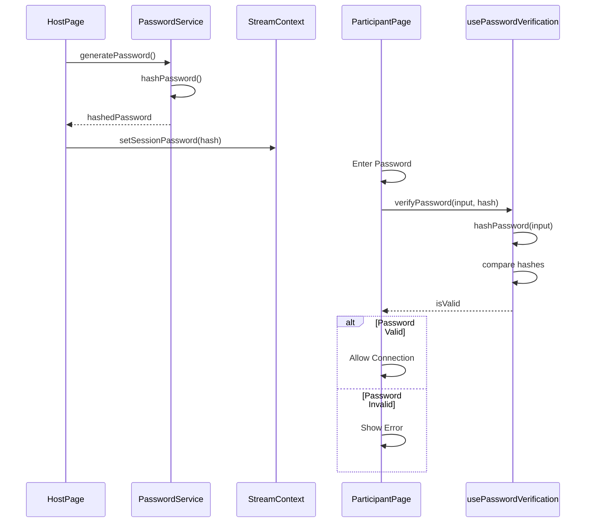
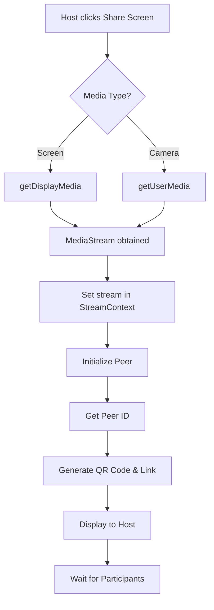
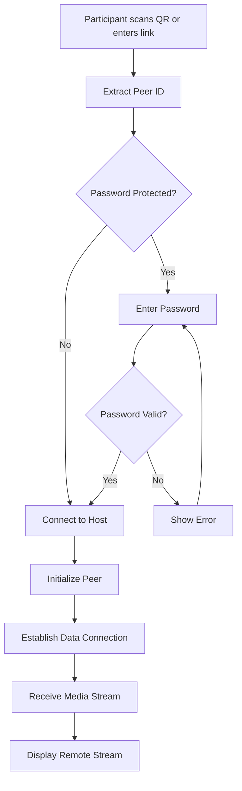

# Architecture
Perspective is a P2P screen sharing web application.
The Host shares screen and camera, and Participants can receive streams in real-time.

## Data Flow

### Host → Participant Streaming

### Password Authentication Flow

## Main Feature Flows

### 1. Start Host Screen Share

### 2. Participant Connection

