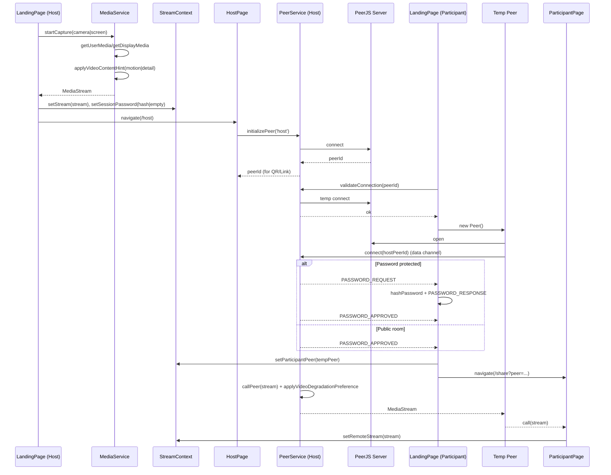
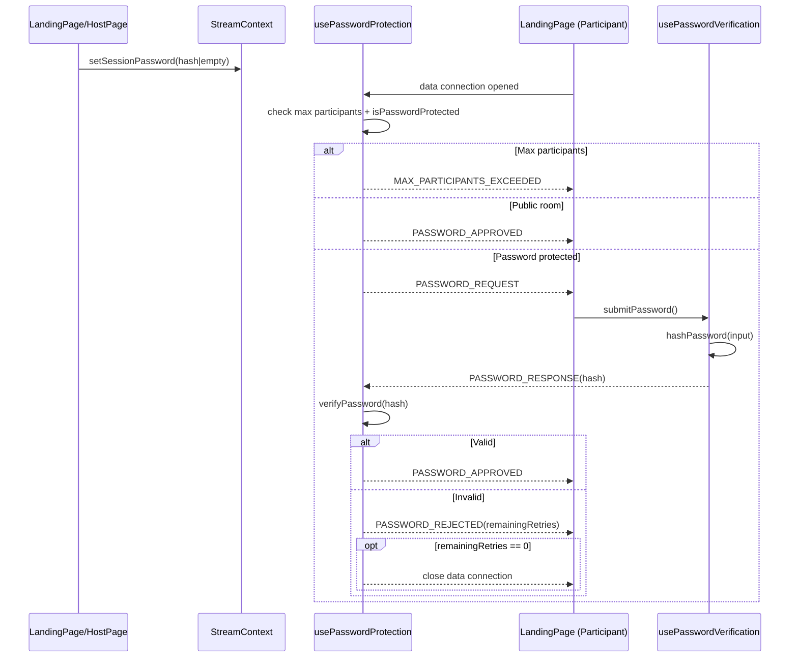
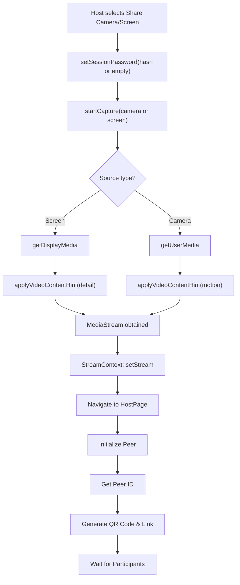
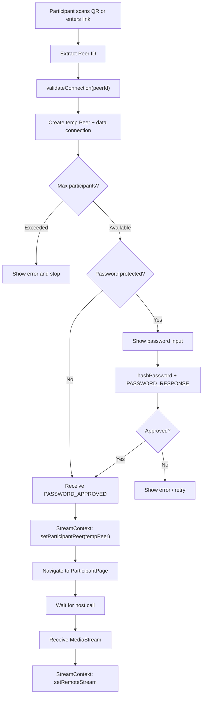
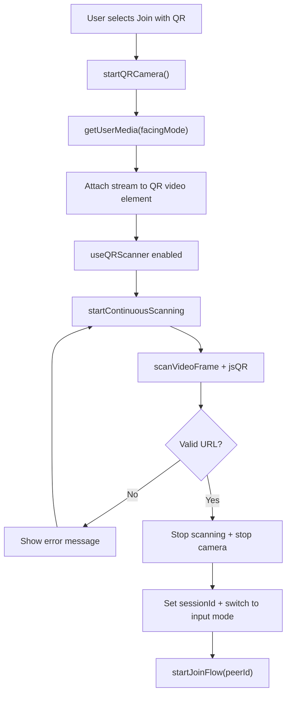
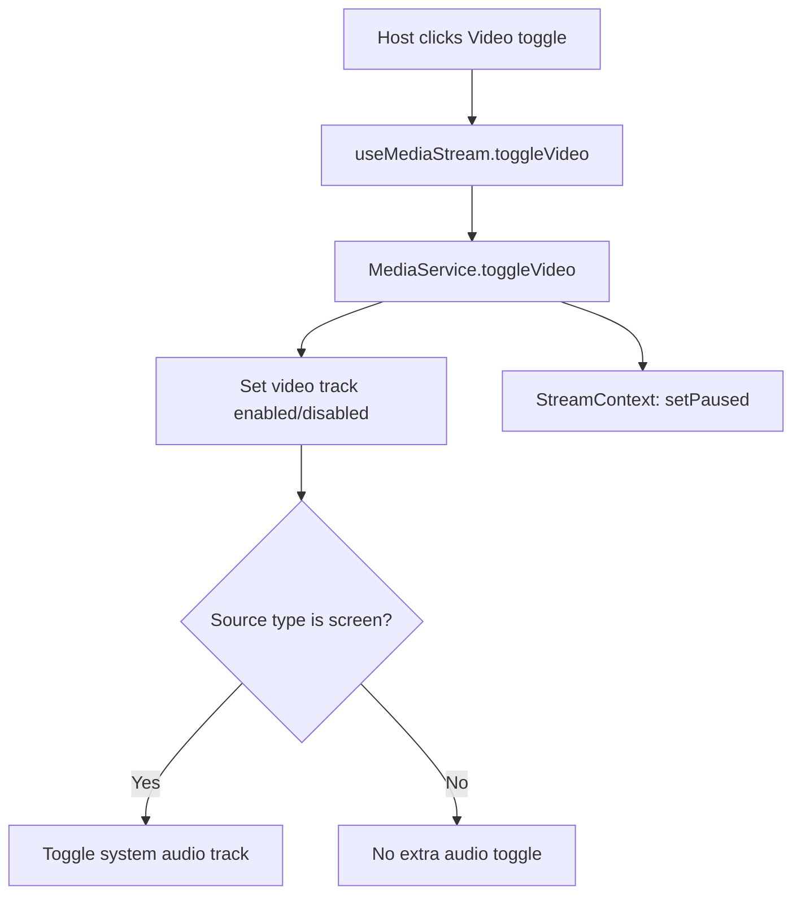
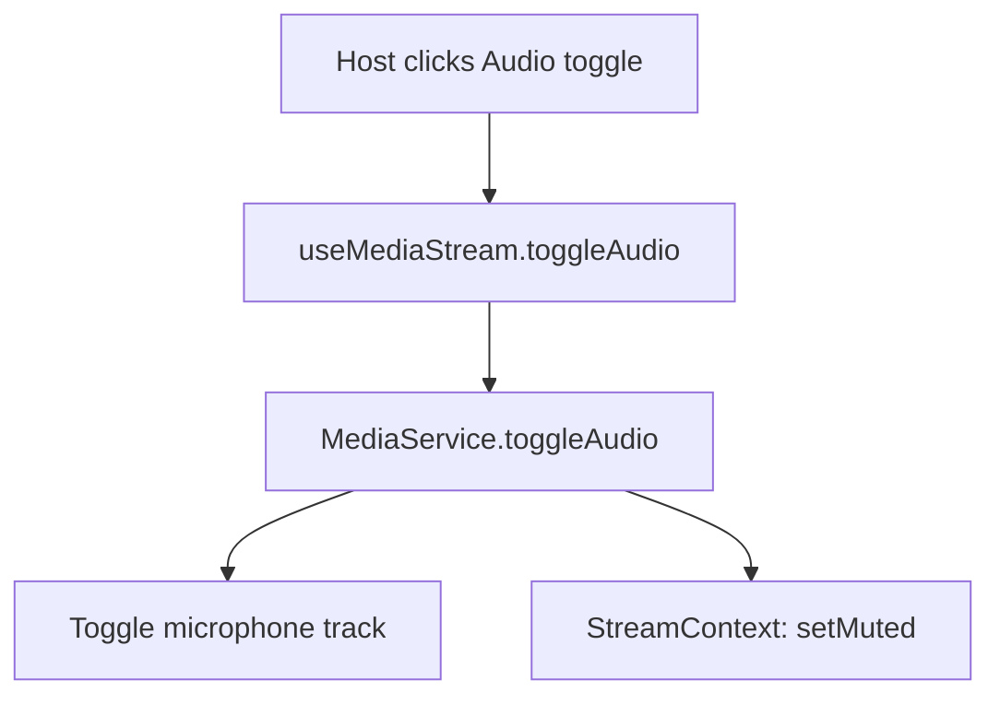
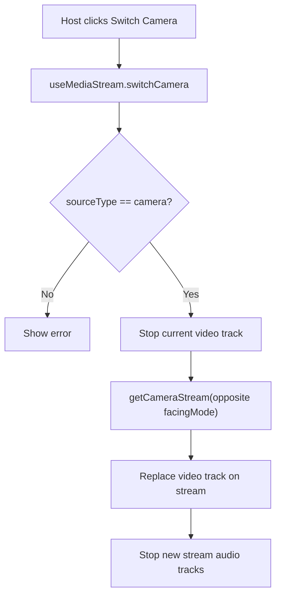
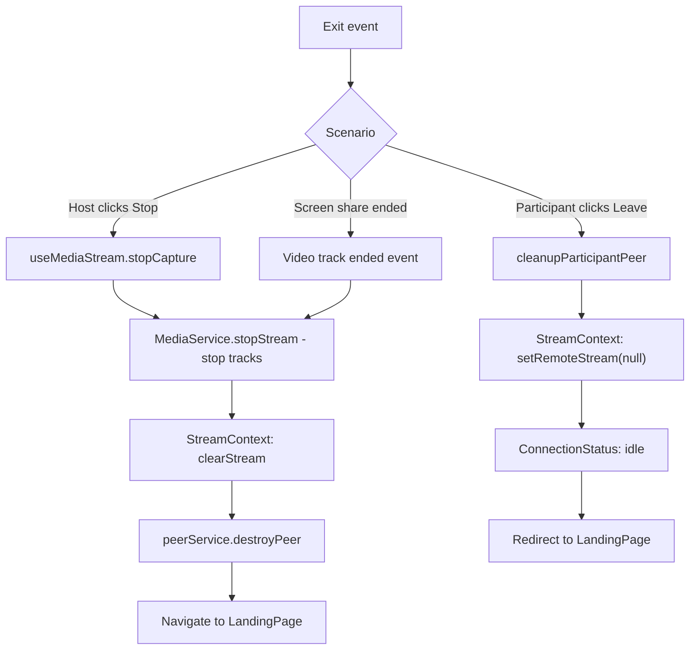

# Architecture
Perspective is a P2P screen sharing web application.
The Host shares screen or camera, and Participants receive the stream in real-time.

## Data Flow

### Host to Participant Streaming

### Password Authentication Flow

## Main Feature Flows

### 1. Start Host Share

### 2. Participant Connection

### 3. QR Scan and URL Validation

## Media Control Flows

### 1. Host Toggle Video

### 2. Host Toggle Audio

### 3. Host Switch Camera

## Cleanup and Exit

