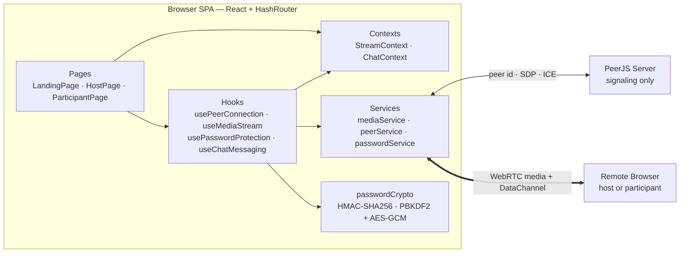
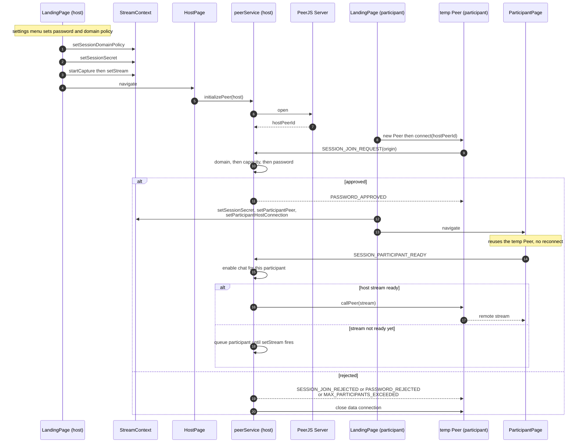
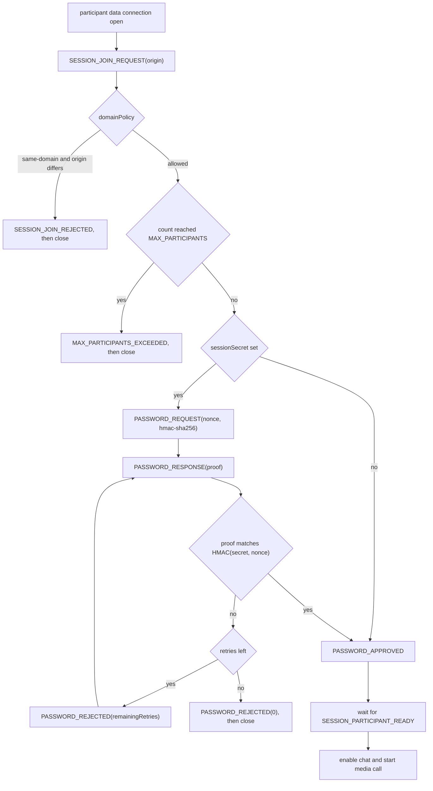
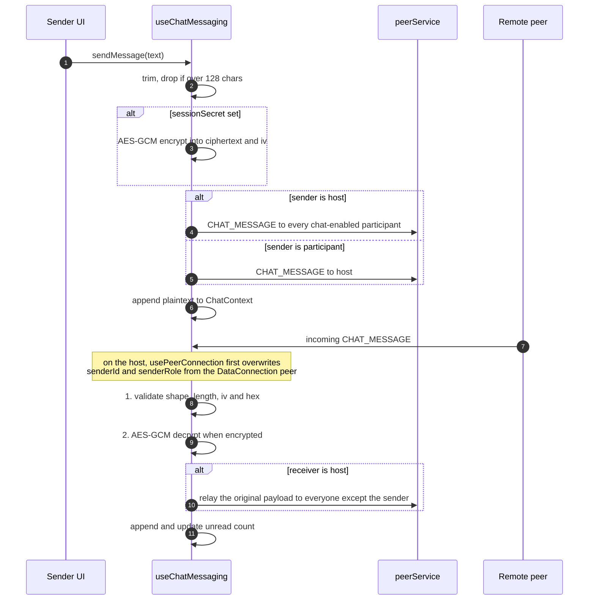
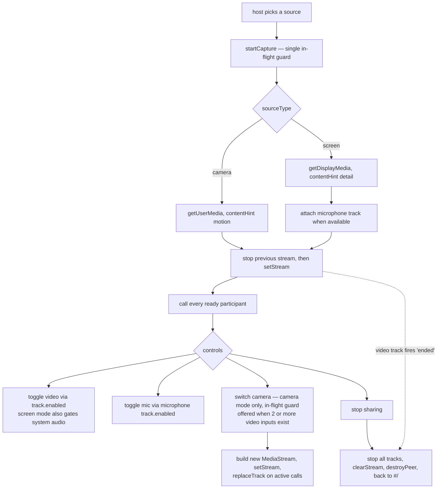
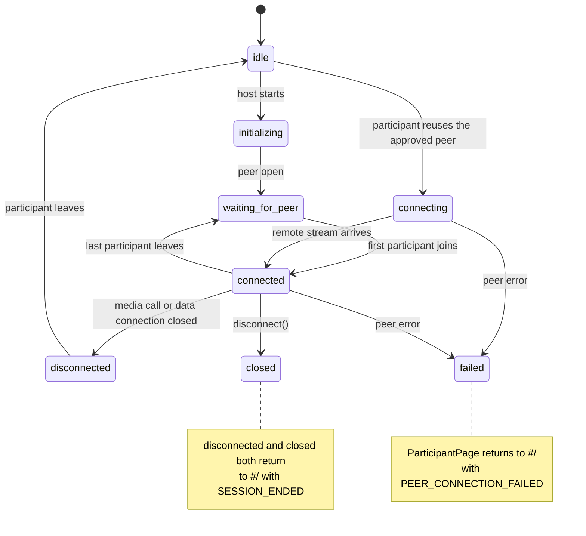
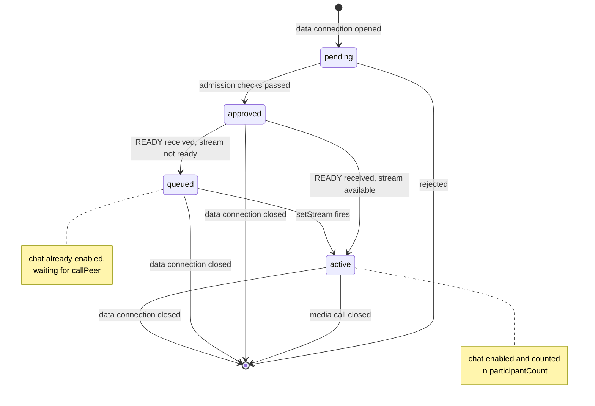
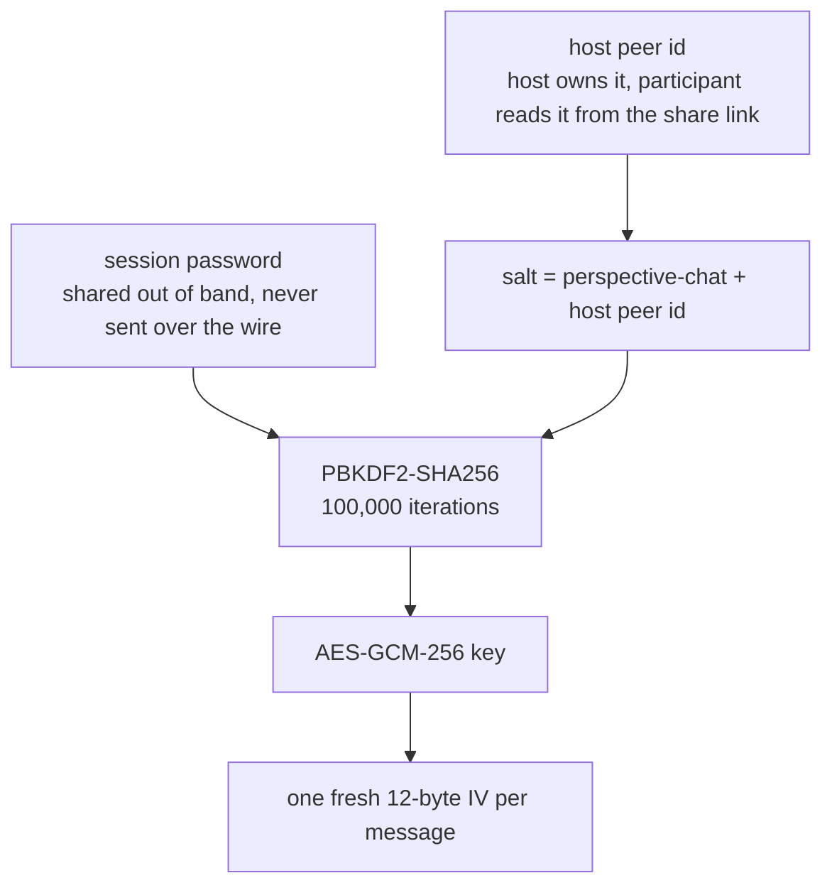

# Architecture

Media and chat travel peer-to-peer over WebRTC. The PeerJS server only relays
signaling (peer id, SDP, ICE) and never sees stream or message content.

## 1. Runtime Topology

```mermaid
flowchart LR
    subgraph App["Browser SPA — React + HashRouter"]
        direction TB
        Pages["Pages<br/>LandingPage · HostPage · ParticipantPage"]
        Ctx["Contexts<br/>StreamContext · ChatContext"]
        Hooks["Hooks<br/>usePeerConnection · useMediaStream<br/>usePasswordProtection · useChatMessaging"]
        Svc["Services<br/>mediaService · peerService · passwordService"]
        Crypto["passwordCrypto<br/>HMAC-SHA256 · PBKDF2 + AES-GCM"]

        Pages --> Ctx
        Pages --> Hooks
        Hooks --> Ctx
        Hooks --> Svc
        Hooks --> Crypto
    end

    Signal["PeerJS Server<br/>signaling only"]
    Remote["Remote Browser<br/>host or participant"]

    Svc <-->|"peer id · SDP · ICE"| Signal
    Svc <==>|"WebRTC media + DataChannel"| Remote
```

## 2. Routes

| Route | Page | Role |
| --- | --- | --- |
| `#/` | LandingPage | Create or join a session, password prompt, QR scan |
| `#/host` | HostPage | Capture and broadcast |
| `#/share?peer=<hostPeerId>` | ParticipantPage | Receive |

## 3. Session Flow

```mermaid
sequenceDiagram
    autonumber
    participant L as LandingPage (host)
    participant S as StreamContext
    participant H as HostPage
    participant P as peerService (host)
    participant J as PeerJS Server
    participant PL as LandingPage (participant)
    participant TP as temp Peer (participant)
    participant PP as ParticipantPage

    Note over L: settings menu sets password and domain policy
    L->>S: setSessionDomainPolicy
    L->>S: setSessionSecret
    L->>S: startCapture then setStream
    L->>H: navigate #/host
    H->>P: initializePeer(host)
    P->>J: open
    J-->>P: hostPeerId

    PL->>TP: new Peer then connect(hostPeerId)
    TP->>P: SESSION_JOIN_REQUEST(origin)
    P->>P: domain, then capacity, then password

    alt approved
        P-->>TP: PASSWORD_APPROVED
        PL->>S: setSessionSecret, setParticipantPeer,<br/>setParticipantHostConnection
        PL->>PP: navigate #/share?peer=hostPeerId
        Note over PP: reuses the temp Peer, no reconnect
        PP->>P: SESSION_PARTICIPANT_READY
        P->>P: enable chat for this participant
        alt host stream ready
            P->>TP: callPeer(stream)
            TP-->>PP: remote stream
        else stream not ready yet
            P->>P: queue participant until setStream fires
        end
    else rejected
        P-->>TP: SESSION_JOIN_REJECTED or PASSWORD_REJECTED<br/>or MAX_PARTICIPANTS_EXCEEDED
        P->>TP: close data connection
    end
```

## 4. Access Control

```mermaid
flowchart TD
    A["participant data connection open"] --> B["SESSION_JOIN_REQUEST(origin)"]
    B --> C{"domainPolicy"}
    C -->|"same-domain and origin differs"| D["SESSION_JOIN_REJECTED, then close"]
    C -->|allowed| E{"count reached MAX_PARTICIPANTS"}
    E -->|yes| F["MAX_PARTICIPANTS_EXCEEDED, then close"]
    E -->|no| G{"sessionSecret set"}
    G -->|no| H["PASSWORD_APPROVED"]
    G -->|yes| I["PASSWORD_REQUEST(nonce, hmac-sha256)"]
    I --> R["PASSWORD_RESPONSE(proof)"]
    R --> K{"proof matches HMAC(secret, nonce)"}
    K -->|yes| H
    K -->|no| L{"retries left"}
    L -->|yes| M["PASSWORD_REJECTED(remainingRetries)"]
    M --> R
    L -->|no| N["PASSWORD_REJECTED(0), then close"]
    H --> O["wait for SESSION_PARTICIPANT_READY"]
    O --> Q["enable chat and start media call"]
```

Capacity counts pending, approved, queued and active participants together, so a
join in progress cannot slip past the limit.

Admission runs on a listener registered once per data connection, which outlives
the render that created it, so `sessionSecret` and `domainPolicy` are read
through refs and a mid-session change applies to the next join.

These checks assume peers run the stock client. The origin behind the domain
policy is self-reported in `SESSION_JOIN_REQUEST` and the retry budget is keyed
by peer id, so a reload yields a fresh budget. Both hold only under that
assumption; the password proof itself does not depend on it.

## 5. Chat

```mermaid
sequenceDiagram
    autonumber
    participant U as Sender UI
    participant CM as useChatMessaging
    participant PS as peerService
    participant R as Remote peer

    U->>CM: sendMessage(text)
    CM->>CM: trim, drop if over 128 chars
    alt sessionSecret set
        CM->>CM: AES-GCM encrypt into ciphertext and iv
    end
    alt sender is host
        CM->>PS: CHAT_MESSAGE to every chat-enabled participant
    else sender is participant
        CM->>PS: CHAT_MESSAGE to host
    end
    CM->>CM: append plaintext to ChatContext

    R->>CM: incoming CHAT_MESSAGE
    Note over CM: on the host, usePeerConnection first overwrites<br/>senderId and senderRole from the DataConnection peer
    CM->>CM: 1. validate shape, length, iv and hex
    CM->>CM: 2. AES-GCM decrypt when encrypted
    alt receiver is host
        CM->>PS: relay the original payload to everyone except the sender
    end
    CM->>CM: append and update unread count
```

Participants never talk to each other directly; the host is the only relay.

`payload.timestamp` carries the sender's wall clock, so it is never compared
against the receiver's clock — a peer whose clock lags would otherwise have
every message silently discarded. A ChatContext is created per page mount and
only ever holds messages from the current connection, so ordering follows
arrival and no freshness filter is applied on either the receive or the render
path.

## 6. Media Lifecycle

```mermaid
flowchart TD
    A["host picks a source"] --> B["startCapture — single in-flight guard"]
    B --> C{"sourceType"}
    C -->|camera| D["getUserMedia, contentHint motion"]
    C -->|screen| E["getDisplayMedia, contentHint detail"]
    E --> F["attach microphone track when available"]
    D --> G["stop previous stream, then setStream"]
    F --> G
    G --> H["call every ready participant"]
    H --> I{"controls"}
    I --> I1["toggle video via track.enabled<br/>screen mode also gates system audio"]
    I --> I2["toggle mic via microphone track.enabled"]
    I --> I3["switch camera — camera mode only, in-flight guard<br/>offered when 2 or more video inputs exist"]
    I3 --> I4["build new MediaStream, setStream,<br/>replaceTrack on active calls"]
    I --> I5["stop sharing"]
    I5 --> Z["stop all tracks, clearStream, destroyPeer, back to #/"]
    G -.->|"video track fires 'ended'"| Z
```

Degradation preference follows the source: `maintain-resolution` for screen,
`maintain-framerate` for camera.

The switch itself flips `facingMode` between `user` and `environment`, which the
browser resolves per device. Availability is decided by video input count alone,
so a desktop with two webcams is offered the control even though the two facings
are not meaningful there.

## 7. Connection Status

```mermaid
stateDiagram-v2
    [*] --> idle

    idle --> initializing: host starts
    initializing --> waiting_for_peer: peer open
    waiting_for_peer --> connected: first participant joins
    connected --> waiting_for_peer: last participant leaves

    idle --> connecting: participant reuses the approved peer
    connecting --> connected: remote stream arrives

    connected --> disconnected: media call or data connection closed
    connected --> closed: disconnect()
    connecting --> failed: peer error
    connected --> failed: peer error
    disconnected --> idle: participant leaves

    note right of failed
        ParticipantPage returns to #/
        with PEER_CONNECTION_FAILED
    end note

    note right of closed
        disconnected and closed both return
        to #/ with SESSION_ENDED
    end note
```

Losing the signaling socket is not a session failure: peers that already hold a
WebRTC connection keep streaming without it. `peerService` therefore retries
`peer.reconnect()` up to `SIGNALING_RECONNECT.MAX_ATTEMPTS` times with
exponential backoff from `BASE_DELAY`, leaving the status untouched while it
retries. A successful retry re-emits `open`, which is routed to `onReconnect`
rather than `onOpen` so the peer id is not reassigned; the host recomputes its
status from the live participant count. Only once the retries are exhausted does
`onDisconnect` fire and move the status to `disconnected`.

## 8. Participant State on the Host

```mermaid
stateDiagram-v2
    [*] --> pending: data connection opened
    pending --> approved: admission checks passed
    pending --> [*]: rejected

    approved --> active: READY received, stream available
    approved --> queued: READY received, stream not ready
    queued --> active: setStream fires

    active --> [*]: media call closed
    approved --> [*]: data connection closed
    queued --> [*]: data connection closed
    active --> [*]: data connection closed

    note right of queued
        chat already enabled,
        waiting for callPeer
    end note

    note right of active
        chat enabled and counted
        in participantCount
    end note
```

All four states count toward the capacity limit in section 4. Leaving any of
them clears the matching entry and disables chat for that peer.

## 9. Chat Key Derivation

```mermaid
flowchart TD
    A["host peer id<br/>host owns it, participant reads it from the share link"] --> C
    B["session password<br/>shared out of band, never sent over the wire"] --> D

    C["salt = perspective-chat + host peer id"] --> D
    D["PBKDF2-SHA256<br/>100,000 iterations"] --> E["AES-GCM-256 key"]
    E --> F["one fresh 12-byte IV per message"]
```

Binding the salt to the host peer id gives every session a distinct key, so a
table built for one session is worthless against another and a password reused
across sessions no longer reproduces the same key. Admission uses the same
password on a separate path: the participant returns
`HMAC-SHA256(password, nonce)` and the password itself never leaves the browser.
