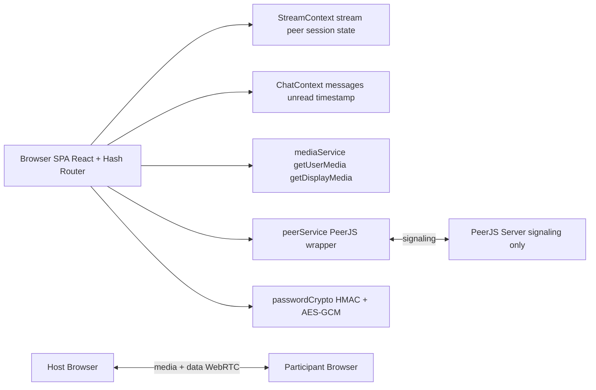
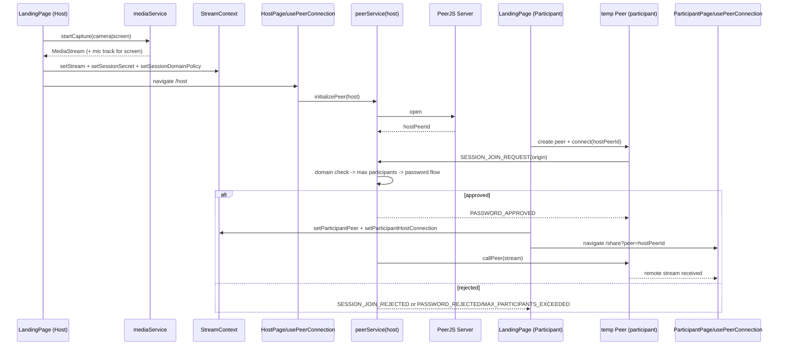
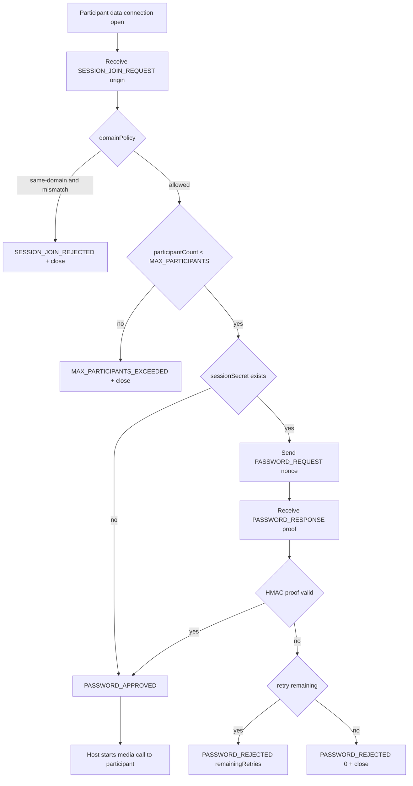
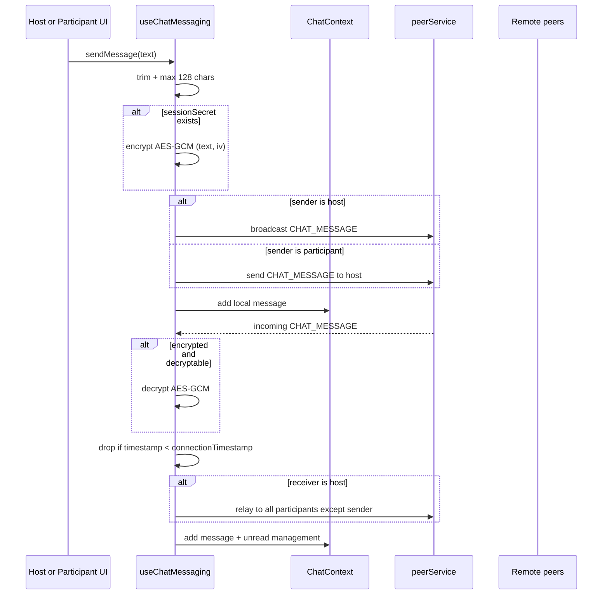
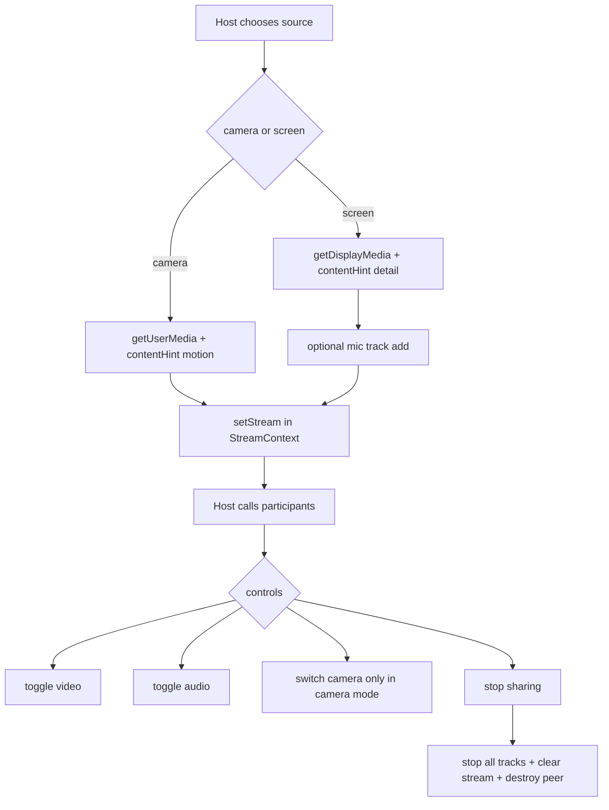

# Architecture

## 1) Runtime Topology

```mermaid
flowchart LR
    Browser[Browser SPA React + Hash Router]
    StreamCtx[StreamContext stream peer session state]
    ChatCtx[ChatContext messages unread timestamp]
    MediaSvc[mediaService getUserMedia getDisplayMedia]
    PeerSvc[peerService PeerJS wrapper]
    Crypto[passwordCrypto HMAC + AES-GCM]
    PeerJSServer[PeerJS Server signaling only]
    Host[Host Browser]
    Participant[Participant Browser]

    Browser --> StreamCtx
    Browser --> ChatCtx
    Browser --> MediaSvc
    Browser --> PeerSvc
    Browser --> Crypto
    PeerSvc <-->|signaling| PeerJSServer
    Host <-->|media + data WebRTC| Participant
```

## 2) End-to-End Session Flow

```mermaid
sequenceDiagram
    participant L as LandingPage (Host)
    participant M as mediaService
    participant S as StreamContext
    participant H as HostPage/usePeerConnection
    participant P as peerService(host)
    participant J as PeerJS Server
    participant PL as LandingPage (Participant)
    participant TP as temp Peer (participant)
    participant PP as ParticipantPage/usePeerConnection

    L->>M: startCapture(camera|screen)
    M-->>L: MediaStream (+ mic track for screen)
    L->>S: setStream + setSessionSecret + setSessionDomainPolicy
    L->>H: navigate /host
    H->>P: initializePeer(host)
    P->>J: open
    J-->>P: hostPeerId

    PL->>TP: create peer + connect(hostPeerId)
    TP->>P: SESSION_JOIN_REQUEST(origin)
    P->>P: domain check -> max participants -> password flow
    alt approved
        P-->>TP: PASSWORD_APPROVED
        PL->>S: setParticipantPeer + setParticipantHostConnection
        PL->>PP: navigate /share?peer=hostPeerId
        P->>TP: callPeer(stream)
        TP-->>PP: remote stream received
    else rejected
        P-->>PL: SESSION_JOIN_REJECTED or PASSWORD_REJECTED/MAX_PARTICIPANTS_EXCEEDED
    end
```

## 3) Access Control (Domain + Password + Capacity)

```mermaid
flowchart TD
    A[Participant data connection open] --> B[Receive SESSION_JOIN_REQUEST origin]
    B --> C{domainPolicy}
    C -->|same-domain and mismatch| D[SESSION_JOIN_REJECTED + close]
    C -->|allowed| E{participantCount < MAX_PARTICIPANTS}
    E -->|no| F[MAX_PARTICIPANTS_EXCEEDED + close]
    E -->|yes| G{sessionSecret exists}
    G -->|no| H[PASSWORD_APPROVED]
    G -->|yes| I[Send PASSWORD_REQUEST nonce]
    I --> J[Receive PASSWORD_RESPONSE proof]
    J --> K{HMAC proof valid}
    K -->|yes| H
    K -->|no| L{retry remaining}
    L -->|yes| M[PASSWORD_REJECTED remainingRetries]
    L -->|no| N[PASSWORD_REJECTED 0 + close]
    H --> O[Host starts media call to participant]
```

## 4) Chat Flow (DataChannel Relay)

```mermaid
sequenceDiagram
    participant Sender as Host or Participant UI
    participant Hook as useChatMessaging
    participant Ctx as ChatContext
    participant PS as peerService
    participant Receiver as Remote peers

    Sender->>Hook: sendMessage(text)
    Hook->>Hook: trim + max 128 chars
    alt sessionSecret exists
        Hook->>Hook: encrypt AES-GCM (text, iv)
    end
    alt sender is host
        Hook->>PS: broadcast CHAT_MESSAGE
    else sender is participant
        Hook->>PS: send CHAT_MESSAGE to host
    end
    Hook->>Ctx: add local message

    PS-->>Hook: incoming CHAT_MESSAGE
    alt encrypted and decryptable
        Hook->>Hook: decrypt AES-GCM
    end
    Hook->>Hook: drop if timestamp < connectionTimestamp
    alt receiver is host
        Hook->>PS: relay to all participants except sender
    end
    Hook->>Ctx: add message + unread management
```

## 5) Media Lifecycle

```mermaid
flowchart TD
    A[Host chooses source] --> B{camera or screen}
    B -->|camera| C[getUserMedia + contentHint motion]
    B -->|screen| D[getDisplayMedia + contentHint detail]
    D --> E[optional mic track add]
    C --> F[setStream in StreamContext]
    E --> F
    F --> G[Host calls participants]
    G --> H{controls}
    H --> I[toggle video]
    H --> J[toggle audio]
    H --> K[switch camera only in camera mode]
    H --> L[stop sharing]
    L --> M[stop all tracks + clear stream + destroy peer]
```

## 6) Route-Level Structure
```mermaid
flowchart LR
    App[App] --> EB[ErrorBoundary]
    EB --> SP[StreamProvider]
    SP --> R[Hash Router]
    R --> LP[/]
    R --> HP[/host]
    R --> PP[/share?peer=...]
    HP --> CP1[ChatProvider]
    PP --> CP2[ChatProvider]
```
