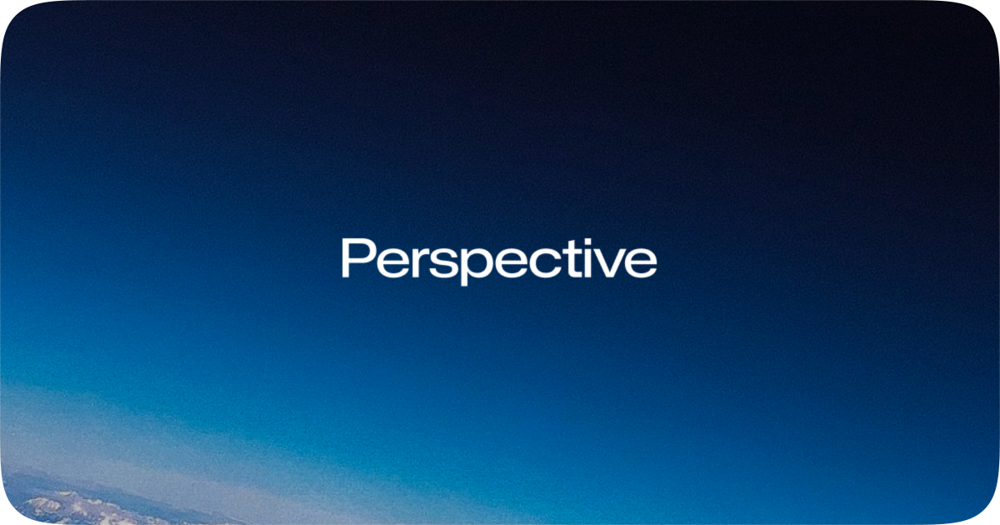

<div align="center"><br>



**Perspective** is a WebRTC-based Peer-to-Peer real-time screen and camera sharing web application that enables direct media stream sharing between clients.

By utilizing a static client design, it ensures seamless connectivity across any hosting environment as long as standardized signaling protocols are met. This architecture maximizes technical neutrality and connection autonomy by minimizing server intervention, facilitating a purely direct exchange between users.  
<br>

[](https://github.com/BackGwa/Perspective/graphs/contributors)
[](https://github.com/BackGwa/Perspective/network/members)
[](https://github.com/BackGwa/Perspective/stargazers)
[](https://github.com/BackGwa/Perspective/issues)
[](https://github.com/BackGwa/Perspective/blob/main/LICENSE)  
[](https://github.com/BackGwa/Perspective/releases)
[](https://github.com/BackGwa/Perspective/actions)  

<br>
</div>

## Getting Started
[](https://backgwa.github.io/Perspective/)
[](https://perspective-development.pages.dev/)

### Installation
1. Clone the repository
```bash
git clone https://github.com/BackGwa/Perspective.git
cd Perspective
```

2. Install dependencies
```bash
cd app
npm install
```

### Environment Variables
Copy the `.env.example` file to `.env` in the `app` directory and configure the required values.

```bash
cp .env.example .env
```
<details>
<summary>Environment Variables</summary>

```env
# PeerJS Server Configuration
VITE_PEERJS_HOST=
VITE_PEERJS_PORT=
VITE_PEERJS_PATH=
VITE_PEERJS_SECURE=true
VITE_STUN_SERVER_URL=

# Session Settings
VITE_MAX_PARTICIPANTS=128
VITE_MAX_PASSWORD_RETRIES=3

# Media Quality Settings
VITE_MAX_RESOLUTION_WIDTH=1920
VITE_MAX_RESOLUTION_HEIGHT=1080
VITE_MAX_FRAMERATE=30

# Connection Settings
VITE_CONNECTION_TIMEOUT=30
VITE_RECONNECT_ATTEMPTS=3

# SEO Settings
VITE_APP_DOMAIN=https://yourdomain.com/
```

> **Note**
> If PeerJS server settings are left empty, the PeerJS public server will be used.
> For production environments, it is recommended to run your own PeerJS server.
</details>

### Production Build
```bash
npm run build
npm run preview
```

Built files will be generated in the `app/dist` directory.

## Architecture
Perspective uses a fully P2P architecture. It transmits media streams directly between host and participants through WebRTC, with the PeerJS server used only for signaling purposes. Media data never passes through the server, ensuring privacy.

It supports password authentication and session control through data connections, as well as NAT traversal via STUN servers.

For detailed architecture information, see [ARCHITECTURE.md](./ARCHITECTURE.md).

## Contributing
Thank you for contributing to Perspective!
For contribution guidelines, branch naming conventions, and PR guidelines, please refer to [CONTRIBUTING.md](./CONTRIBUTING.md).


## License
This project is distributed under the MIT License. See the [LICENSE](./LICENSE) file for more details.
